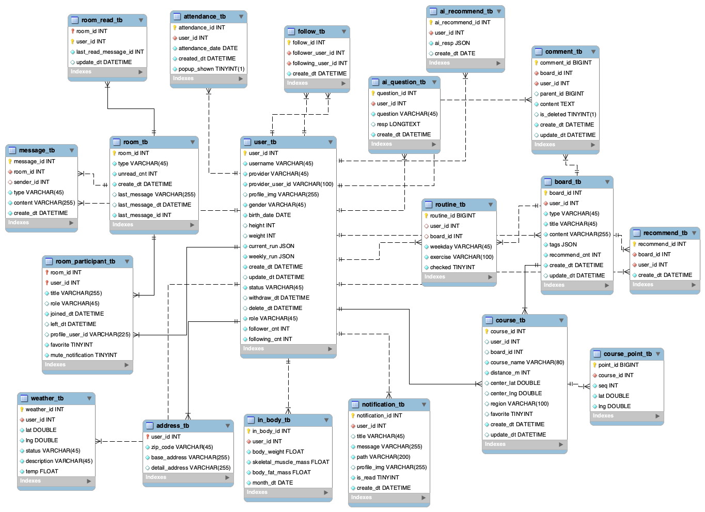

# 🏃 Route In – Frontend

> 러닝코스 경로 공유 & 실시간 소통 커뮤니티 플랫폼

Kakao Map 기반 러닝코스 등록·공유, 실시간 채팅, AI 코스 추천 기능을 제공하는 운동 특화 모바일 웹 서비스입니다.

🔗 [Backend 레포](https://github.com/Koreait-Triple-Stack/route_in_backend)　|　🔗 [배포 주소](https://routein.store)

---

## 📌 프로젝트 개요

| 항목 | 내용 |
| --- | --- |
| 개발 기간 | 2026.01.07 ~ 2026.02.13 (5주) |
| 인원 | 3인 팀 |
| 본인 역할 | **팀장** · 프론트엔드 일부 + 백엔드 전반 |
| 본인 담당 (FE) | React Query / Zustand 상태 관리 · WebSocket 실시간 채팅 UI · 알림 시스템 UI · Kakao Map 컴포넌트 |

---

## 🛠 Tech Stack

| 구분 | 기술 |
| --- | --- |
| Framework | React 18 |
| 서버 상태 관리 | React Query |
| 전역 상태 관리 | Zustand |
| HTTP 통신 | Axios |
| 실시간 통신 | WebSocket (STOMP) |
| UI | MUI |
| 외부 API | Kakao Map API |

---

## ✨ 주요 기능

### 🗺 러닝코스 등록 · 공유
- Kakao Map 기반 지도 표시 · 경로 생성
- 출발지 / 경유지 / 도착지 설정, 거리 자동 계산
- 게시글 형태로 코스 공유
- 다른 사용자 코스 복사 후 개인 저장
- 커스텀 Hook으로 Kakao Map 로직 분리 관리
- Polyline + Marker 동적 렌더링
- `ref cleanup`으로 지도 객체 메모리 누수 방지

### 💬 실시간 채팅
- WebSocket(STOMP) 기반 메시지 송수신
- unread count 배지 실시간 표시
- `message_id + create_dt` 복합 커서 기반 무한스크롤
- React Query 캐시와 WebSocket 수신 메시지 동기화
- Presence(접속 상태) 실시간 반영

### 🔔 알림 시스템
- WebSocket 실시간 알림 Push
- Snackbar UI로 즉시 표시
- 알림 클릭 시 해당 페이지 이동
- 알림 읽음 상태 서버 동기화

### 📰 게시글 커뮤니티
- 운동루틴 · 러닝코스 게시글 CRUD
- 댓글 / 대댓글
- 1인 1추천
- 커서 기반 무한스크롤 피드
- React Query `mutation → invalidateQueries`로 UI 자동 동기화

### 🤖 AI 운동 추천
- 날씨 + 운동 기록 기반 맞춤 코스 추천
- 자유 질문 및 이전 질문 히스토리 조회

### 📊 인바디 그래프
- 체중 · 골격근량 · 체지방 시계열 차트
- Optimistic update로 즉시 반영

### 📅 주간 루틴
- 요일별 루틴 등록 · 체크 완료
- Optimistic update 적용

---

## 🔑 기술적 의사결정

### 1. 서버 상태 · 전역 상태 분리 — React Query + Zustand

| 구분 | 도구 | 이유 |
| --- | --- | --- |
| 서버 상태 (API 응답) | React Query | 캐싱 · 자동 갱신 · 로딩/에러 처리를 선언적으로 관리 |
| 전역 UI 상태 | Zustand | 모달 · 알림 등 서버와 무관한 클라이언트 상태를 단순하게 관리 |

두 상태를 하나의 저장소에 혼용하면 서버 응답 시점과 UI 상태가 꼬이는 문제가 발생합니다.
React Query와 Zustand를 역할에 따라 분리해 **API 호출 흐름과 UI 상태의 일관성**을 유지했습니다.

---

### 2. WebSocket 수신 메시지 → React Query 캐시 동기화

WebSocket으로 새 메시지를 수신할 때마다 `invalidateQueries` 대신 `queryClient.setQueryData`로 캐시를 직접 업데이트해 **불필요한 API 재요청 없이 UI를 즉시 갱신**했습니다.

---

## 🔍 트러블슈팅

### 1. unread count 불일치

**문제** : 채팅방 입장 시 unread 개수가 실제와 다르게 표시

**원인** : `room_read` 구조가 마지막 읽음 기준을 안정적으로 표현하지 못해 타이밍에 따라 누락/중복 발생

**해결** : 백엔드에서 `last_read_message_id` 기준으로 구조 변경, 프론트에서는 채팅방 입장 시 읽음 처리 요청을 WebSocket 연결 직후로 순서 보장

---

### 2. Presence 동기화 오류

**문제** : 브라우저 탭 닫기·새로고침 시 접속 상태가 갱신되지 않음

**원인** : WebSocket 연결 종료 이벤트를 클라이언트에서만 처리하려 해 탭 강제 종료 시 이벤트 미발송

**해결** : 서버에서 `SessionDisconnectEvent`로 연결 종료를 감지하도록 구조 변경, 클라이언트는 `ENTER_ROOM / LEAVE_ROOM` 이벤트만 담당

---

### 3. Drawer 외부 클릭 닫기 · 레이아웃 밀림

**문제** : `hideBackdrop` 사용 시 배경 클릭 감지 안 됨, backdrop 사용 시 레이아웃 밀림

**원인** : Drawer가 Portal/body로 마운트되면서 레이아웃 기준이 달라지고 backdrop 이벤트가 container 밖에서 잡힘

**해결** : Drawer를 채팅 영역 ref로 제한 + `disablePortal` 적용, backdrop 대신 투명 클릭 레이어를 직접 구현해 `onClick`으로 닫기 처리

---

### 4. Snackbar 떠있는 동안 하단 요소 클릭 불가

**문제** : Snackbar가 화면 상단에 떠있는 동안 아래 요소 클릭이 안 됨

**원인** : Snackbar 이벤트 레이어가 클릭을 가로챔

**해결** : Snackbar 컨테이너에 `pointerEvents: "none"`, 실제 Alert/Button에만 `pointerEvents: "auto"` 적용

---

## 🗂 ERD

---

## 🔗 링크

| 구분 | 링크 |
| --- | --- |
| 배포 (서비스) | https://routein.store |
| Backend 레포 | https://github.com/Koreait-Triple-Stack/route_in_backend |
| Frontend 레포 | https://github.com/Koreait-Triple-Stack/route_in_frontend |
